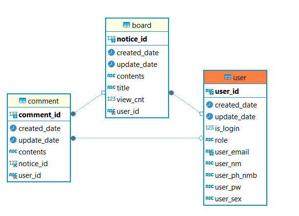

<h1 align="center">5조 프로젝트 👍</h1>

> [플레이 데이터] 데이터 엔지니어링 29 기

프로젝트 주제: 순례 길 안내 및 커뮤니티 플랫폼  

프로젝트 주제 설명:  
- "순례길 관광객들을 위한 순례 루트 계획 및 추천  
- 순례 루트 주변 인프라(상가,숙박 등) 정보 제공  
- 실시간 Talk를 통한 상태 및 감정 공유"

활용 기술 스택: Java, Springboot, Bootstrap

주제 선정 이유: 여행을 다니면서 다양한 어플을 사용해본 결과, 한국인을 위한 어플이 없었고, 여행자들끼리 경로를 공유했으면 좋겠다는 필요성을 느낌

🎬[Demo 시연영상](https://www.youtube.com/watch?v=dhMrKTwNI8U&lc=UgzCJR3WxkvsckRyyO94AaABAg&ab_channel=%EB%94%B0%EB%9D%BC%ED%95%98%EB%A9%B4%EC%84%9C%EB%B0%B0%EC%9A%B0%EB%8A%94IT)   

----------

## ✨ 프로젝트 설명


```sh
📦main
 ┣ 📂java
 ┃ ┗ 📂com
 ┃ ┃ ┗ 📂example
 ┃ ┃ ┃ ┗ 📂travelproject
 ┃ ┃ ┃ ┃ ┣ 📂config
 ┃ ┃ ┃ ┃ ┃ ┣ 📂auth
 ┃ ┃ ┃ ┃ ┃ ┃ ┣ 📜AuthProvider.java
 ┃ ┃ ┃ ┃ ┃ ┃ ┣ 📜AuthUserDto.java
 ┃ ┃ ┃ ┃ ┃ ┃ ┗ 📜AuthUserService.java
 ┃ ┃ ┃ ┃ ┃ ┣ 📂base
 ┃ ┃ ┃ ┃ ┃ ┃ ┣ 📜BaseEntity.java
 ┃ ┃ ┃ ┃ ┃ ┃ ┗ 📜DateUtil.java
 ┃ ┃ ┃ ┃ ┃ ┣ 📂constant
 ┃ ┃ ┃ ┃ ┃ ┃ ┗ 📜AuthenticationTypes.java
 ┃ ┃ ┃ ┃ ┃ ┣ 📂handler
 ┃ ┃ ┃ ┃ ┃ ┃ ┣ 📜LoginAuthFailureHandler.java
 ┃ ┃ ┃ ┃ ┃ ┃ ┣ 📜LoginAuthSuccessHandler.java
 ┃ ┃ ┃ ┃ ┃ ┃ ┗ 📜LogoutAuthSuccesshandler.java
 ┃ ┃ ┃ ┃ ┃ ┗ 📜SecurityConfig.java
 ┃ ┃ ┃ ┃ ┣ 📂controller
 ┃ ┃ ┃ ┃ ┃ ┣ 📜BoardController.java
 ┃ ┃ ┃ ┃ ┃ ┣ 📜CommentController.java
 ┃ ┃ ┃ ┃ ┃ ┣ 📜LodgeController.java
 ┃ ┃ ┃ ┃ ┃ ┣ 📜MainController.java
 ┃ ┃ ┃ ┃ ┃ ┣ 📜MypageController.java
 ┃ ┃ ┃ ┃ ┃ ┗ 📜PlanController.java
 ┃ ┃ ┃ ┃ ┣ 📂model
 ┃ ┃ ┃ ┃ ┃ ┣ 📂dao
 ┃ ┃ ┃ ┃ ┃ ┃ ┣ 📂impl
 ┃ ┃ ┃ ┃ ┃ ┃ ┣ 📜BoardDao.java
 ┃ ┃ ┃ ┃ ┃ ┃ ┣ 📜CommentDao.java
 ┃ ┃ ┃ ┃ ┃ ┃ ┗ 📜UserDao.java
 ┃ ┃ ┃ ┃ ┃ ┣ 📂dto
 ┃ ┃ ┃ ┃ ┃ ┃ ┣ 📜BoardDto.java
 ┃ ┃ ┃ ┃ ┃ ┃ ┣ 📜CommentDto.java
 ┃ ┃ ┃ ┃ ┃ ┃ ┗ 📜UserDto.java
 ┃ ┃ ┃ ┃ ┃ ┣ 📂entity
 ┃ ┃ ┃ ┃ ┃ ┃ ┣ 📜BoardEntity.java
 ┃ ┃ ┃ ┃ ┃ ┃ ┣ 📜CommentEntity.java
 ┃ ┃ ┃ ┃ ┃ ┃ ┗ 📜UserEntity.java
 ┃ ┃ ┃ ┃ ┃ ┗ 📂repository
 ┃ ┃ ┃ ┃ ┃ ┃ ┣ 📜BoardRepository.java
 ┃ ┃ ┃ ┃ ┃ ┃ ┣ 📜CommentRepository.java
 ┃ ┃ ┃ ┃ ┃ ┃ ┗ 📜UserRepository.java
 ┃ ┃ ┃ ┃ ┣ 📂service
 ┃ ┃ ┃ ┃ ┃ ┣ 📂impl
 ┃ ┃ ┃ ┃ ┃ ┣ 📜BoardService.java
 ┃ ┃ ┃ ┃ ┃ ┣ 📜CommentService.java
 ┃ ┃ ┃ ┃ ┃ ┗ 📜UserService.java
 ┃ ┃ ┃ ┃ ┗ 📜TravelprojectApplication.java
 ┗ 📂resources
 ┃ ┣ 📂static
 ┃ ┣ 📂templates
 ┃ ┃ ┣ 📂board
 ┃ ┃ ┣ 📂common
 ┃ ┃ ┣ 📂lodge
 ┃ ┃ ┣ 📂login
 ┃ ┃ ┣ 📂plan
 ┃ ┃ ┣ 📂staff
 ┃ ┃ ┣ 📂temp
 ┃ ┃ ┗ 📜index.html
 ┃ ┣ 📜application.yml
 ┃ ┣ 📜intro_1.jpg
 ┃ ┣ 📜intro_2.jpg
 ┃ ┗ 📜intro_3.jpg
```
📂controller  
 📜BoardController.java : 게시판 페이지  
 📜CommentController.java : 게시글 내의 페이지  
 📜MainController.java : 메인 페이지  
 📜MypageController.java : 마이 페이지  
  
📂service  
 📜BoardService.java : 게시판 작성/수정/삭제 기능 구현  
 📜CommentService.java : 댓글 작성/수정/삭제 기능 구현  
 📜UserService.java : 회원가입/탈퇴/정보수정 및 ID/PW 찾기 기능 구현  

----------

## 📌 프로젝트 목표

```sh
Mysql를 이용하여 설계를 통한 ERD 작성 및 구현
```

----------

## 🐧 프로젝트 구현

> ### 🏢 **ERD**

<div align="center">
  
</div>

----------

## 🤼‍♂️팀원

Team Leader : 🐯**강재전**

Member : 🐶 **안현준**

Member : 🐺 **김서윤**

Member : 🐱 **조은별**

Member : 🦁 **유성민**

